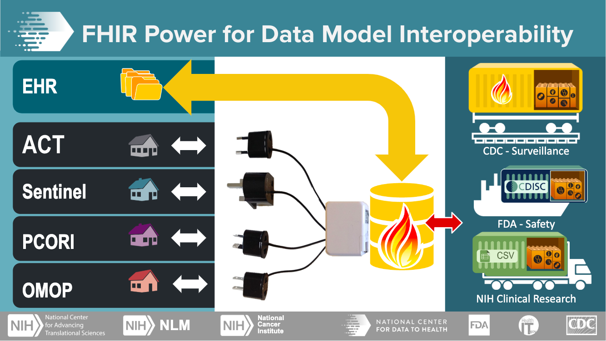
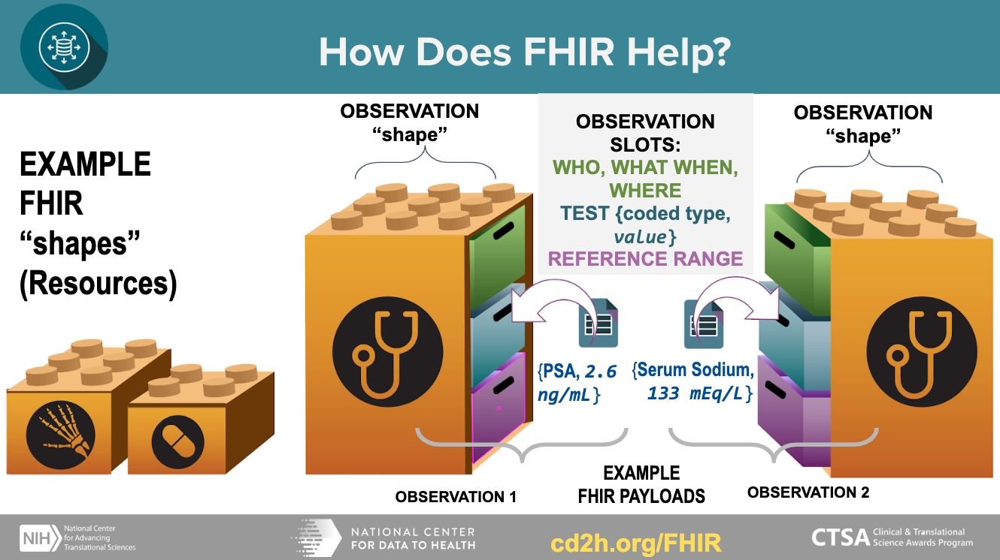

# Chapter 6: Understanding Data Harmonization

## About this document

### Version: 1.0

### Date: 4.23.20

Drafted and Edited by:

Co-leads: Boyd Knosp, University of Iowa ([https://orcid.org/0000-0002-3834-3135](https://orcid.org/0000-0002-3834-3135)); Catherine K. Craven, Icahn School of Medicine at Mount Sinai

Christopher G. Chute, Johns Hopkins University ([https://orchid.org/0000-0001-5437-2545](https://orchid.org/0000-0001-5437-2545)); Jeanne Holden-Wiltse, University of Rochester CTSI ([https://orcid.org/0000-0003-2694-7465](https://orcid.org/0000-0003-2694-7465)); Laura Paglione, Spherical Cow Group ([https://orcid.org/0000-0003-3188-6273](https://orcid.org/0000-0003-3188-6273)); Svetlana Rojevsky, Tufts Clinical and Translational Science Institute ([https://orcid.org/0000-0002-8353-9006](https://orcid.org/0000-0002-8353-9006)); Juliane Schneider, Harvard Catalyst | Clinical and Translational Science Center ([https://orcid.org/0000-0002-7664-3331](https://urldefense.proofpoint.com/v2/url?u=https-3A__orcid.org_0000-2D0002-2D7664-2D3331&d=DwMGaQ&c=WO-RGvefibhHBZq3fL85hQ&r=JGyJ5ZTej1yt_CZfoAG_h-lfWMuBpKQjlyuYpq2sbixAcvYm_qHIRvOYcRg4PMnt&m=Qaw7ejGjguwe5X5a7RCEaIGpQlQDPiGtF__MDCnTgU4&s=DLE08RAhR3_1ujCS2kGgzuGbgwjNyi0zk7mVGl--WjA&e=)); Adam Wilcox, University of Washington.

Edited by: Lisa O’Keefe, Charisse Madlock-Brown, Andréa Volz

### Purpose & Intended Audience

This resource offers guidance to members of the [CTSA](#ctsa) informatics community including information about [Data Harmonization](#data-harmonization) that key stakeholders (leadership, researchers, clinicians, CIOs) can use at their institutions. This guidance can be useful to those who are new to [Data Harmonization](#data-harmonization), as well as to those who are experts and may need assistance conveying the importance of [Data Harmonization](#data-harmonization) to a lay audience.

### Role of the CD2H Sustainability & Change Management Task Team (SCM)

[CTSA](#ctsa) informatics researchers strive to harmonize or combine their clinical data so that it can be available for users to query and view it in a unified format. The CD2H Sustainability and Change Management Task Team ([SCM](#scm)) of the Clinical [Data Harmonization](#data-harmonization) Working Group aims to aggregate, develop, curate, and disseminate content and tools that help encourage and guide organizations’ understanding of and investments in [Data Harmonization](#data-harmonization) efforts. Many institutions are engaged in such efforts, but decision-makers do not always have a shared language for discussing these issues with ease or a full understanding of their facets. We aim to remedy that here.

### Why is this work important?

Clinical data are among the most valuable artifacts within [CTSA](#ctsa) hubs. Appropriately leveraging these data for translational research purposes, while respecting privacy and honoring hub autonomy, will advance [CTSA](#ctsa) goals and demonstrate its power as a network. The Health Level 7 (HL7) [FHIR](#fhir) standard has the potential to enable hubs to develop a next-generation repository from application program interfaces (APIs) that are built into every electronic health record (EHR). For optimal harmonization, these APIs need to be integration-ready, whether used directly for federated queries or for transformation to any number of common standards.

### About the authors and contributors of this guide

The National Center for Data to Health (CD2H) tasked the [SCM](#scm) of the Clinical [Data Harmonization](#data-harmonization) Working Group with creating a maturity model for clinical [Data Harmonization](#data-harmonization), as well as a roadmap and resources to help organizations plan and execute their harmonization efforts. The [SCM](#scm) aims to create educational events and provide information about the goals and benefits of [Data Harmonization](#data-harmonization).

## 1\. Why are we talking about Data Harmonization?

### What is Data Harmonization?

[Data Harmonization](#data-harmonization) is the process of integrating disparate data of varying types, sources, and formats. [Data Harmonization](#data-harmonization) for research use refers to the ability of an organization to connect with external data-driven clinical and translational research projects involving patient data across multiple institutions (Clinical Data Research Networks or [CDRN](#cdrn)s, such as [PCORnet](#pcornet), [ACT](#act), [OHDSI](#ohdsi), [TriNetX](#trinetx)). Coordinating this process involves not only the development and implementation of technology but also implementation of procedures and governance policies, and harnessing relevant expertise.

It is worth noting that the terms *harmonization* and *standardization* are both used to attain the same goal of data homogeneity. However, while standardization is about conformity, harmonization implies consistency. According to the Cambridge Biomedical Research Centre (UK), “standardization refers to the implementation of uniform processes for prospective collection, storage and transformation of data.[...] Harmonization is a more flexible approach that is more realistic than standardisation in a collaborative context. Harmonization refers to the practices which improve the comparability of variables from separate studies, permitting the pooling of data collected in different ways, and reducing study heterogeneity”.[1](#kix.qoavunstds55) We can see the standardization approaches in the development of [Common Data Models (CDMs)](#common-data-models-(cdms)) and harmonization becomes essential for retrospective collaborative research.

[CTSA](#ctsa)s have been building, participating in, and using [CDRN](#cdrn)s for several years with a variety of experiences and outcomes. The Clinical [Data Harmonization](#data-harmonization) Working Group believes these experiences contain lessons learned and intends to develop best practices for [Data Harmonization](#data-harmonization) from them. These best practices can guide organizations on emerging opportunities, such as new technologies and opportunities to join new networks. Helping develop, curate, and communicate/encourage action on this guidance is the purpose of the [SCM](#scm).

### Value Proposition of Data Harmonization

The quality, depth, and breadth of data and samples collected by healthcare organizations has provided increasing opportunities to advance knowledge and population health. Unfortunately, many healthcare institutions exist as silos with no ability to integrate patient data externally. Millions of inpatient and outpatient medical records containing structured data on clinical procedures, medications, diagnoses, demographics, lab results, and genomics, as well as unstructured data documented as free text in progress notes, cannot be used to their full potential. For example, rare diseases research or outcomes research, often require larger datasets than what is available at a single health care organization. Massive datasets offer more comprehensive analysis and the ability to probe specific research questions with more confidence in the results. To be able to make sense of vast information, [Data Harmonization](#data-harmonization) is needed to ask and answer important questions, and to provide evidence for policy changes in areas of standard of care, care delivery, coverage structure, and emerging population health trends.

In the past decades, the field has significantly moved from simple healthcare data digitization[2](#kix.9brwper0q0kh) to proactive and focused acquisition, aggregation, and standardization through the use of [Common Data Models](#common-data-models) ([CDM](#cdm)s). Currently, informatics teams frequently use harmonization and aggregation to improve the interoperability and compatibility of data among independent organizations that are willing to share and collaborate.[3](#kix.oszxd4uut1kq) [Data Harmonization](#data-harmonization) is a stepping stone to conducting reproducible, collaborative research and is crucial to promoting efficient and timely communication between different stakeholders in the healthcare data domain. If not appropriately addressed, the lack of harmonization becomes a bottleneck, both for research and for sustainable operations. Impactful global health trends may be missed due to the variety of barriers, most of which lay within technical domains, as well as harmonization and standardization domains. A significant percentage of healthcare spending is wasted as a consequence of data silos[4](#kix.zdysifo08sr1); therefore, the economic impact of data interoperability should be a significant factor in proposals urging for changes towards [Data Harmonization](#data-harmonization). A significant effort has been made in [data standardization](#data-standardization) and harmonization of research datasets through the work of Clinical Data Interchange Standards Consortium (CDISC).[5](#kix.inn5u2e3050u) It is time for healthcare data used for research to undergo a similar transformation.

*SUMMARY:* *[Data Harmonization](#data-harmonization)* *has a direct impact on quality, reproducibility, and confidence of research that uses data contained in the EHR system. Effective data interoperability leads to improved efficiency of methods and processes, improved time from research project design, through trend identification to policy implementation, and results in cost savings due to increased efficiency and a decreased need for data wrangling. Emerging local, national, and global networks, such as* *[ACT](#act)**,* *[PCORnet](#pcornet)**,* *[OHDSI](#ohdsi)**,* *[TriNetX](#trinetx)* *and others that rely on* *[Common Data Models ](#common-data-models-)**and harmonized data sources, bring about opportunities for global-scale research and policy implementation. Analysis of massive harmonized datasets can provide better insight into population health and reduce local, national, and global healthcare spending waste.*

### Risks of not moving forward

What do research enterprises risk if they do not participate in [Data Harmonization](#data-harmonization)? A lack of harmonization restricts researchers to analyzing different data sources separately, which is counterintuitive to the reality of present-day collaborative research. Project-specific [Data Harmonization](#data-harmonization) is an exhaustive, time-consuming process[6](#kix.vf3i9fva7zvn). Reports indicated that research project harmonization can require up to 6 months to complete, and that about 30% of the data deemed impossible to harmonize and was excluded from the final dataset. Time spent on wrangling data and custom coding takes resources away from finding insights that drive discoveries forward and slows the process of achieving public benefit from them. This exhaustive process negatively impacts the time to and cost of discovery and, therefore, the cost of care. The cost increase eventually creates a barrier for access to care by disadvantaged segments of the population and smaller, less developed countries.

Pending a comprehensive literature review, it is evident that the risks of not moving forward with [Data Harmonization](#data-harmonization) efforts include, but are not limited to: (1) the extensive use of resources (both human and financial) on data wrangling, rather than on research and implementation of findings into healthcare; (2) the delayed ability or inability to improve human health based upon the knowledge that is gleaned from larger, harmonized disparate datasets; and (3) the reduction of an institution’s competitiveness for grant funding and top faculty recruitment, which could cause decreased pharmaceutical engagement for high profile studies.

*SUMMARY: The risks of not moving forward with* *[Data Harmonization](#data-harmonization)* *lead to protracted research efforts, delays in translating research to improve population health, and creates barriers for access to care for the disadvantaged.*

### Assessing the impact of Data Harmonization

To fully understand the impact of the [Data Harmonization](#data-harmonization) efforts on areas of research operations, one needs to define, implement, and consistently collect metrics to assess the return on investment (ROI) of those initiatives. If a research enterprise chooses to embark on [Data Harmonization](#data-harmonization) activities, how do we measure the ROI and impact? What are the potential metrics of success? How is success characterized?

As we will demonstrate below, [Data Harmonization](#data-harmonization) is a part of the measure of organizational maturity, and achieving a high score on the maturity index means the organization is implementing strategies identified as impactful for the overall success. Regularly assessing organizations on the maturity index for the [Data Harmonization](#data-harmonization) domain can provide insights into the success of the effort. Additionally, informatics teams can implement processes and research-impact related measures alongside the maturity index. These key performance indicators (KPIs) could include, but are not limited to, the following examples; *(1) the decrease in time required for* *[Data Harmonization](#data-harmonization)* *steps; (2) the percent increase of data available for research after the harmonization process (i.e. decrease in discarded data because of the inability to harmonize); (3) the increased number of multi-site research and collaborations; (4) the increased number of publications, findings, and policy implementations; (5) intellectual property filings that can be attributed to organizations choosing to invest into* *[Data Harmonization](#data-harmonization)* *efforts either directly or toward initiatives leading up to it.*

## 2\. Is your organization ready for Data Harmonization?

**Maturity** refers to the organizational capacity to deliver a service while considering multiple factors including culture, policy, and organization. The [Data Harmonization](#data-harmonization) maturity index is a questionnaire that assesses an organization's capacity to connect with external data-driven clinical and translational research projects (often referred to as Clinical Data Research Networks or [CDRN](#cdrn)s) involving patient data.

### Fill out the Data Harmonization Maturity Index for Assessment

Click [here](http://j.mp/2GvfPum) (http://j.mp/2GvfPum) to go to a draft version of the [Data Harmonization](#data-harmonization) Index. This index is under development; however, even in draft form, it can provide insights into an organization's maturity regarding mission, governance, sustainability, workforce, infrastructure, relationship with the clinical enterprise, data practices, and external relationships. It also provides topics for an institution to discuss regarding its capacity to participate in [Data Harmonization](#data-harmonization) efforts.

After reviewing the results, read the section titled "Harmonized Data Maturation” to learn more about aspects of the maturity assessment.

## 3\. Harmonized Data Maturation
[7](#kix.vgagxbo4zq1o)
[Data Harmonization](#data-harmonization) is a journey, not a destination. To realize its values and benefits, organizations must make it an integral strategic component of daily practices and workflows. Here we discuss 8 maturity categories that are essential for harmonized data maturation and sustainability. As organizations increase their capabilities in each area, they increase their organizational maturity.

### Data Harmonization Mission

Maturity in this category means:

- Organization has defined a reason to participate in a  Clinical Data Research Network (CDRN)- Organization has defined what  CDRNs they want to participate in
- Organization has an implementation plan for participating in a  CDRN- Organization has a strategic plan for participating in a  CDRN
**Defining Participation Reason.** Understanding the current state of the biomedical academic enterprise provides insight into the “why” of [Data Harmonization](#data-harmonization) and the challenge of sustaining harmonization efforts. There are extensive databases of ever-expanding clinical data due to the national uptake of electronic health records in hospitals and clinics of all sizes. Most institutions have also created data warehouses, sometimes several, for specific purposes (e.g., operations or research), out of which researchers can export  EHR and other data for long-term storage and access them for purposes other than clinical care.

Computer science algorithms have been created to process these data for many types of research. Some methods collectively, although obtusely, referred to as “AI” include machine learning and data mining techniques, and are being applied to further develop vast data sets. Many researchers are working to demonstrate the value that these computational methods can provide to health care. Areas of interest include “development of drug development pipelines; phenome-wide association studies when linked with genotyped biospecimens; characterization of treatment pathways for large numbers of patients, multi-site trial recruitment, automated data collection, and delivery of real-word evidence at the point of care to actualize the learning healthcare system, e.g., developing predictive models for clinical decision support put into place within the EHR for a variety of conditions.”[8](#kix.9r1ayja43czo) Pooling large amounts of clinical data may make major research strides possible. Technologically, we can handle the storage and processing power needed to do so, although there are costs to all institutions to ensure this.

An organization must support clinical [Data Harmonization](#data-harmonization) via implementation and ongoing maintenance of crosswalks of mapped data, which requires informatics expertise and guidance. These mappings or crosswalks connect different [Common Data Models](#common-data-models) ([CDM](#cdm)) to ensure that each data element from one [CDM](#cdm) matches with the correct data element from another [CDM](#cdm). These crosswalks provide interoperability and support reproducibility.

**Defining CDRN Participation.** Researchers at an organization must be able to easily determine which [CDM](#cdm) and [CDRN](#cdrn) their organization participates in, which data this connection will afford them to access, and what additional benefits they can receive because of the [CDRN](#cdrn) participation. To support this goal, organizations must be able to state which research networks they will and will not participate in, the particular [Common Data Models](#common-data-models) they do not support, and what data their researchers will not have access to as a result. They also must understand the choices their collaborators and competitors are making regarding [CDRN](#cdrn) and [CDM](#cdm) and the potential impact of those choices. Finally, they need to understand how their choices may impact the organization’s credibility, their standing in the research world, the opportunities for their researchers, and their ability to recruit competitively.

**Creating a CDRN Implementation Plan.** Why is [Data Harmonization](#data-harmonization) necessary for interoperability in the first place, especially given that so many institutions have purchased their EHR from the same vendor?

There are myriad ways that the set-up of these systems can affect which data are collected, at what level of granularity, how they are labeled, and the concepts for which any given piece of data is meant to represent. In addition, when data are exported from their source system, e.g., an EHR, into a data warehouse, decisions are made that can affect the data in many ways (such as the impact of ETL based on decisions and the rationale behind them.

Consortia of institutions have been formed to work together to create mappings for harmonizing their data and sharing it in Clinical Data Research Networks ([CDRN](#cdrn)). The most well known include the Accrual to Clinical Trials ([ACT](#act)) network; the All of Us research program; [TriNetX](#trinetx), a private company-driven network to support clinical trials; and [PCORnet](#pcornet)®, National Patient-Centered Clinical Research Network, a group of networks including 9 clinical research networks, 2 health plan research networks, several coordinating centers, and its main funder, PCORI, the Patient-Centered Outcomes Research Institute.

Each participating institution maps their data to a [Common Data Model (CDM)](#common-data-model-(cdm)) developed or used by a [CDRN](#cdrn). In the past, institutions had to build their models from scratch. Sometimes they still try to do this and end up with the models very similar to the existing [CDM](#cdm)s. The creation of a new [CDM](#cdm) is therefore  rarely needed. A widely used [CDM](#cdm) optimized for retrospective observational studies is the Observational Medical Outcomes Partnership ([OMOP](#omop)) [CDM](#cdm) [https://www.ohdsi.org/data-standardization/the-common-data-model/](https://www.ohdsi.org/data-standardization/the-common-data-model/), which has gained traction among data scientists who also conduct machine learning. The All of Us research program employs [OMOP](#omop) as its [CDM](#cdm). [PCORnet](#pcornet) has its own [CDM](#cdm) [https://pcornet.org/data-driven-common-model](https://pcornet.org/data-driven-common-model/).
**Integrating Participation into Strategic Planning.** Adequate funding is essential to [Data Harmonization](#data-harmonization) maturation, as are strategic efforts to ensure that when we exchange and pool data from our data warehouses, it matches with “like” data from other institutions. Depending on which national research networks an institution wants to participate in, [Data Harmonization](#data-harmonization) for those networks will have to be supported.

Because each [CDM](#cdm) requires ongoing additions to concepts, data types, other changes, updates to the model itself, and to dependencies (e.g., searches, interfaces, documentation, training, etc.), their maintenance requires ongoing expertise and effort. Institutions must commit to the level of [CDM](#cdm)s and [CDRN](#cdrn) participation they can sustain. An organization that is mature in its [Data Harmonization](#data-harmonization) efforts can handle more models and more complexity.

While few argue against the merits of [CDM](#cdm)s, demonstrable differences in content and structure among them are becoming burdensome for many [CTSA](#ctsa) to manage. The emergence of [FHIR](#fhir) as a clinical standard may mitigate these concerns through a model of low-cost, low-effort creation of [FHIR](#fhir)-based repositories from APIs that will soon be native to all EHRs, per pending regulation arising from the 21st Century Cures Act. These [FHIR](#fhir) repositories, by design, would embrace a canonical [data model](#data-model) framed on the US Core [FHIR](#fhir) Implementation Guide. Given a canonical data hub, distributing algorithmic transformations, created and maintained by consensus, would allow [CTSA](#ctsa) hubs to derive data marts and projections conforming to popular [CDM](#cdm)s.  Further, [federated queries](#federated-queries) across these hubs may obviate the need for research-specific [CDM](#cdm)s, though that remains speculative in the face of the current maturity level in [FHIR](#fhir). Data exchange harmonized with [FHIR](#fhir) can facilitate streamlined integration of data sources for improved population health research.

### Governance

Maturity in this category means:

- Organization has a high-level group that effectively makes decisions about data, including external data sharing agreements.
- Organization’s IRB is experienced in reviewing protocols that use  CDRNs.
- Organization has the legal processes in place to effectively enter into external data sharing agreements.
- Organization’s processes enable decision making at appropriate levels.

An organization must have a governance infrastructure group that makes decisions about data, including [Data Harmonization](#data-harmonization) and research network participation. An organization must have a governance group to make decisions about data and participation, including external data sharing agreements, and participation in [CDRN](#cdrn)s, and [Common Data Models](#common-data-models) ([CDM](#cdm)s). The organization’s Institutional Review Board (IRB) must be proficient in reviewing protocols that use [CDRN](#cdrn)s. The organization must have legal processes in place to effectively enter into external data sharing agreements. Organizational processes must enable decision-making at appropriate levels.

### Sustainability

Maturity in this category means:

- Organization has made a commitment to support  Data Harmonization.- Organization has identified internal funding sources to provide dedicated resources for  Data Harmonization.- Organization has obtained external grants to fund projects that use harmonized data.
- Organization has an effective recharge model in place to help recover some of the costs of  Data Harmonization  for funded research projects.

An organization must define why it is participating in one or more Clinical Data Research Networks and associated [Common Data Models](#common-data-models). It must declare ongoing organizational and financial support to sustain the [Data Harmonization](#data-harmonization) necessary for participation. Organizations cannot sustain harmonization without alignment with their mission and ongoing declared and financial support. This is true for all infrastructure related to conducting research. EHR data provide a rich source of information, and various internal and external entities continue to request access in large numbers. However, the existence of data in the EHR does not mean it is automatically accessible or “shovel-ready” to use for secondary purposes. Making EHR data accessible and ready to use requires infrastructure and expertise. One of many data-related considerations in [Data Harmonization](#data-harmonization) is the need to prepare data for interoperable use across organizations via the implementation of [Common Data Models](#common-data-models), most often in Clinical Data Research Networks ([CDRN](#cdrn)s). A useful 2014 article, “Sustainability Considerations for Health Research and Analytic Data Infrastructures,” [https://www.ncbi.nlm.nih.gov/pmc/articles/PMC4371522/](https://www.ncbi.nlm.nih.gov/pmc/articles/PMC4371522/)) discusses this topic and the reasons why leaders must address data infrastructure sustainability.

Institutions must allocate funds for [Data Harmonization](#data-harmonization) efforts and incorporate them into capital and operating budgets. One of the ongoing entrenched challenges is the establishment and funding of a health information technology (HIT) infrastructure to support research. Of specific importance is establishing who is responsible for funding the [Data Harmonization](#data-harmonization) efforts. Deans of institutions favor NIH funding for research related activities; however, NIH does not focus on sustaining IT or HIT infrastructure or determining and supporting data standards. Stanford University’s John Ionnidis, MD, DSc, and others have spoken eloquently about funding challenges and misalignments in the scientific enterprise, and academic medical centers’ over-reliance on soft money.[9](#kix.fdndbff4dc4d),[10](#kix.b8y7gxvt5syu),[11](#kix.jrs22bob27gc) Enterprise IT departments often set capital budgets and strategic plans that encompass hardware, software, and tangible deliverables. However, these often do not cover the scientific expertise and personnel necessary to work on data modeling and [data mapping](#data-mapping). Although [CTSA](#ctsa) and PCORI awards can be used for specific projects and purposes regarding [Data Harmonization](#data-harmonization), they are not intended to replace allocated funds from within the institution for sustaining infrastructure and the human expertise that must accompany it. If institutions want to be competitive in research, and compete regarding the external use of their de-identified data for commercial purposes, then committing to [Data Harmonization](#data-harmonization) support is necessary. Benchmarking with other institutions is key for developing appropriate ongoing financial investment and support for [Data Harmonization](#data-harmonization).

### Workforce

Maturity in the category means:

- Organization has a team dedicated to curating and maintaining data in a manner that effectively enables sharing data with  CDRNs.
- Organization has  data architects  to work on  Data Harmonization  efforts.
- Organization has clinical informaticists to work on  Data Harmonization  efforts.
- Organization has a business analyst to work on  Data Harmonization  efforts.
- Organization has project managers available to work on  Data Harmonization  efforts.
An organization must determine how many staff and what type of expertise are necessary to implement and maintain [CDM](#cdm)s for the organization’s declared [CDRN](#cdrn) participation and interoperability goals. Although partners in [CDRN](#cdrn)s use automated processes to extract, transform, map, and standardize data to the selected [CDM](#cdm)s, the process requires ongoing human expertise, oversight, curation, and quality assurance testing to ensure that the data are correct, complete, and the processes are working. This doesn’t happen by itself, nor will it ever, and will require people with expertise to oversee and conduct these processes.

The organization must determine which staff will maintain these data, how many are required to perform the work, and what their work entails. Examples of tasks associated with maintaining data include participation in ongoing consortial meetings, following up on updates, extending mapping to cover additional data, and performing required quality checks.

Benchmarking with other organizations is critical in determining adequate and optimal staff who possess the level of expertise that highly successful [Data Harmonization](#data-harmonization) teams include, e.g., informaticists. Towards this effort, organizations should consult the in-progress maturity model for [Data Harmonization](#data-harmonization). Additionally, they should track the efforts of ongoing research projects that address workforce development issues (e.g., 2019-2020 deliverables stemming from the [CTSA](#ctsa) Informatics EC and efforts of its Enterprise Data Warehouse Working Group). These activities will shed light on identifying right-sized and right-type staffing.

A final, but not insignificant, workforce consideration is the need for experts to provide strong support and training to aid end-users and ensure responsible use of these harmonized data. Whether those people come from the [Data Harmonization](#data-harmonization) team or not, they must train and support end-users of data by ensuring they share the right type and amount of details regarding [CDM](#cdm)s and [CDRN](#cdrn). End-user training should also include discussions of participation and access issues, and ultimately, increase end-user data literacy.

### Infrastructure

Maturity in this category means:

- Organization has sufficient hardware resources (including networking, storage and server) to enable  Data Harmonization  efforts.
- Organization has sufficient software resources available to enable  Data Harmonization  efforts.
- Organization has an IT infrastructure that supports  Data Harmonization  efforts as part of the organization’s enterprise IT infrastructure.
To fully support [Data Harmonization ](#data-harmonization-)with enterprise IT infrastructure, an organization's IT Department needs to act explicitly towards that end. Enterprise IT must take into account the actual hardware, networking, storage, server, and other software requirements of the institution’s [Data Harmonization](#data-harmonization) work and personnel, and ensure that these needs are planned for and met in ongoing planning and budgeting processes.

### Relationship with the clinical enterprise

Maturity in this category means:

- Organization conducts clinical enterprise values research.
- Organization has an effective clinical IT services operation.
- Organization has a clinical IT reporting team that is aware of  Data Harmonization  efforts.
- Organization has a clinical operation that is aware of the secondary use of clinical data to drive medical research.

This category is related to the research value of the clinical enterprise, such that there is a relationship between the clinical enterprise and [Data Harmonization](#data-harmonization) efforts. The clinical data operation will be aware of the secondary use of clinical data to drive medical research. Most organizations have established this concept, but depth of understanding of data issues and [Data Harmonization](#data-harmonization) varies widely, and “data literacy”—what that means and how to develop it—among clinical data users and researchers, will need ongoing attention. In a mature organization pursuing [Data Harmonization](#data-harmonization), the clinical IT EHR reporting team is aware of [Data Harmonization](#data-harmonization) efforts and can speak cogently about them.

### Data practices

Maturity in this category means:

- Organization’s  Data Harmonization  activities are consistent with enterprise data practices.
- Organization’s  Data Harmonization  teams have established an aggregated database that feeds  Data Harmonization  efforts.
- Organization follows good service management methods for  Data Harmonization  efforts.
- Organization tracks data provenance for data shared with  CDRNs.
- Organization practices FAIR (Findable, Accessible, Interoperable, Reusable) Principles in managing data shared with  CDRNs.

For sustainability, best practices for data must be followed and include [Data Harmonization](#data-harmonization) activities that are consistent with enterprise data practices. The organization must follow good service management methods for [Data Harmonization](#data-harmonization) efforts, as well as FAIR (Findable, Accessible, Interoperable, Reusable) Principles for managing data shared with [CDRN](#cdrn)s. The organization will track data provenance for data shared with [CDRN](#cdrn)s. The organization’s [Data Harmonization](#data-harmonization) team will have established an aggregated database that feeds [Data Harmonization](#data-harmonization) efforts.

### External relationships and outreach

Maturity in this category means:

- Organization has strategies for establishing external collaborations
- Organization is experienced in working with multi-institutional research collaborations
- Organization has participated in at least one clinical data research network

The purpose of [Data Harmonization](#data-harmonization) is the interoperability and exchange of data, particularly for research; therefore, developing, participating in, and maintaining external relationships and outreach for data exchange is an inherent sustainability goal. Organizations must develop strategies for establishing external collaborations, and demonstrate experience with working on multi-institutional research collaborations, including at least one clinical data research network.

## 4\. Data Harmonization Technologies

All [CTSA](#ctsa) hubs understand the basic advantage of a [federated query](#federated-query) and its underlying requirement for a [common data model.](#common-data-model.) Most hubs participate in multiple efforts for standardizing data into multiple [Common Data Models](#common-data-models), which become increasingly less scalable. Meanwhile, the clinical community has been grappling with the interoperability problem, and are seeking a common framework for clinical data rendering and exchange. There has been dramatic progress in clinical data standards over the past 5 years, which provides an opportunity to leverage emergent and dominant clinical data standards.

### Federated Query

A [federated query](#federated-query) provides the ability for one coordinating group to publish an executable algorithm, typically case and control cohorts with comparison analytics that can be independently executed by consortium members. The [CTSA](#ctsa) hubs function in this role. The [federated query](#federated-query) approach ensures that no patient-level data leaves an organization, thereby preserving confidentiality and obviating disclosure.  Other more sophisticated models specify a matrix of tabulations, covariates, or features; a benchmark in the sequence to calculate parameter estimate and variance; and a merger of the matrices for more robust meta-analyses. Since the system only returns cell aggregate sub-totals in the matrix, patient-level data is not exposed.

### Common data models

Widespread adoption of electronic health records (EHR) and emphasis on the reuse of clinical data through integration of clinical care, claims, environmental, and other data requires a robust approach to data modeling to satisfy the complexity and provide maximum usability for effective research. As summarized by Khan et al in the analysis of existing [data models](#data-models) “Data modeling is the process of determining which data elements will be stored and how they will be stored, including their relationships and constraints. The structure and definitions of a data model define what data can be stored, how values should be interpreted, and how easily data can be queried.”[12](#kix.unntzb98ia8x) Significant efforts that have been made by the research community to address the issue of standardization and effective data modeling resulted in a few prominent, widely accepted [Common Data Models](#common-data-models) ([CDM](#cdm))—[PCORnet](#pcornet), [OMOP](#omop), [i2b2](#i2b2), which is well described in a work by Jeffrey G. Khan and colleagues about data model harmonization for the “All Of Us” Research Program.[13](#kix.k5tcvtbx56g2) The section from the publication is shown below to help the audience clarify the landscape of the [Common Data Models](#common-data-models):

“PCORnet common data model ([PCORnet](https://pcornet.org/) [CDM](#cdm))
The [PCORnet](#pcornet)t [Common Data Model](#common-data-model) is supported by all networks in the Patient Centered Outcomes Research Institute, and thus has a wide base of existing support. Over 80 institutions have already transformed their data into this model. It was derived from the Mini-Sentinel [data model](#data-model), which has increasing uptake in claims data analysis.

[PCORne](#pcorne)t [CDM](#cdm) (v3.1) is a traditional relational database design, in which each of fifteen tables corresponds to a clinical domain (e.g., diagnoses, labs, medications, etc.). The tables have many columns including both the table key (patient identifier, encounter identifier, etc.) and additional details (e.g., medication frequency). New releases of the [data model](#data-model) have added new clinical elements or format–for example, new domains (e.g., lab values) and changes in data representation (e.g., smoking status).

Informatics for integrating biology in the bedside ([i2b2](#i2b2))
[i2b2](#i2b2) was first developed over a decade ago through a National Institutes of Health (NIH) grant and continues to grow in popularity. It is currently used at over 200 sites world-wide, and it is used in several large-scale networks, including the NCATS’ national Accrual to Clinical Trials ([ACT](#act)) network.[14](#kix.c35ahcuigvvu),[15](#kix.6pgpj7a1qdf9). [i2b2](#i2b2) uses a star-schema format, pioneered by General Mills in the 1970s and widely used in retail data warehouses.[16](#kix.uz69fbxekobw) The [i2b2](#i2b2) star-schema uses one large “fact” table containing individual observations. This is a narrow table with many rows per patient encounter. [Ontology ](#ontology-)tables (hierarchical arrangements of concepts) provide a window into the data; these are often developed by local implementers. Consequently, the [data model](#data-model) is only modified when core features are added to the platform.
Observational Medical Outcomes Partnership ([OMOP](#omop))

[OMOP](#omop) was developed to be a shared analytics model from the beginning, and it has been adopted by the Observational Health Data Sciences and Informatics ([OHDSI](#ohdsi), pronounced "Odyssey") Consortium, a diverse collaborative dedicated to research and quality improvement.[17](#kix.o16v6vyuezk8) The [OMOP](#omop) [CDM](#cdm) is increasingly utilized, presently at 90 sites worldwide, thanks to [OHDSI](#ohdsi)s large community and many analytical tools. [OMOP](#omop) is a hybrid model that provides domain tables in the vein of [PCORnet](#pcornet), as well as a “fact” table containing individual atomic observations similar to [i2b2](#i2b2). The [OMOP](#omop) schema is significantly more complicated than [PCORnet](#pcornet), and some domain tables are derived values for specific analytical purposes (e.g., drug_era and visit_cost). Unlike [PCORnet](#pcornet) (but similar to[i2b2](#i2b2)’s [ontology](#ontology) system), [OMOP](#omop) provides metadata tables providing information on [terminology](#terminology) and concept relationships.”[18](#kix.eae5me24e5cv)

While each [CDM](#cdm) has creatively executed solutions to support research, each also has its limitations. Organizations planning [Data Harmonization](#data-harmonization) efforts, implementing data warehouses, and choosing [CDM](#cdm)s ultimately need to make a decision based on the majority of the research needs, which has become increasingly difficult. More and more often, sites realize that in order to participate in multi-site research, they need to support all 3 [data models](https://docs.google.com/document/d/1hIX1j2yfqcVbNmVxA8LawHRQ3Ol3Vzciq5JFi9fXdnk/edit#bookmark=id.a25pmlaam5hh) to achieve data interoperability with a collaborator.

### Interoperability: Clinical data rendering and exchange

**Fast Healthcare Interoperability Resources** ([FHIR](#fhir), pronounced “fire”) is a vital standard related to interoperability created by the Health Level 7 (HL7) International health-care standards organization. This standard consists of data formats and elements (“resources”) and an application programming interface (API) for exchanging electronic health records (EHRs.) [FHIR](#fhir)’s greatest strength is that it comes natively out of EHRs through APIs that are regulatorially required.

[FHIR](#fhir) is an open, collaborative community working harmoniously with healthcare, academia, governments, EHR vendors, payers, and patient groups to define a shared specification for health data exchange. It builds upon previous work, while retaining the flexibility to make specification easily usable and understandable. Many practical demonstrations have proven FHIR’s effectiveness at interoperability in open connect-a-thons (an event to prove the efficacy of the standard).

#### Why does FHIR matter?

[FHIR](#fhir) is unique among health information technology standards for enjoying nearly universally positive responses among health systems, academics, government(s), payers, pharma, and most EHR vendors.  Many communities have created [FHIR](#fhir) Accelerators to enrich the rapid progress and maturation around the standard. Most compellingly, [FHIR](#fhir) is embraced and adopted by the system developers for whom [FHIR](#fhir) was designed. This translates into a proliferation of [FHIR](#fhir) throughout the clinical community.

The translational research community can benefit directly from the enormous investments these clinical communities using [FHIR](#fhir) make. The workforce and investments dwarf any that could be marshaled by the translational research community. Rather than reinvent research-specific data standards, it makes sense to leverage the structure, specification, detail, tooling, and infrastructure coming forward from these clinical communities. Pending Office of the National Coordinator for Health Information Technology (ONC) regulations will require that all EHRs support [FHIR](#fhir) API interfaces, profoundly simplifying data access and delivery in a [FHIR](#fhir)-conformant manner. This effectively obviates any need for complex extraction and translation in the creation of [FHIR](#fhir)-based repositories.

NIH is investing in [FHIR](#fhir), not only for EHR exchange but also for research from academia to industry. NIH encourages its researchers to explore the use of the Fast Healthcare Interoperability Resources ([FHIR](#fhir)®) standard to capture, integrate, and exchange clinical data for research purposes and to enhance capabilities to share research data[19](#kix.ivnxrb4488bb),[20](#kix.jhk8xd4xpj5). This use includes:

- Integration of patient- and population-level data from EHR systems
- Access to and management of electronic health information
- Development of clinical decision support systems
- Exchange of EHR data and health documentation
- Enhancement of privacy and security for electronic health information
- Inclusion of common data elements (CDEs) and clinical terminologies to improve interoperability of EHR data for research and clinical care
- Support of a common structure for sharing clinical research data
- Integration of EHR and patient-originated data with clinical research data
- Design and monitoring of clinical trial protocols
- Enhancement of patient recruitment, enrollment, and consent in clinical trials

NIH and related agencies, together with CD2H, have leadership positions in the newly established [HL7 FHIR Accelerator](https://www.hl7.org/about/fhir-accelerator/) for research called Vulcan. The goal of this effort is to ensure the needs and requirements of translational research, specifically those of  the [CTSA](#ctsa) community, are accommodated and incorporated in [FHIR](#fhir) development, evolution, and maturation.

#### How does FHIR work?

[FHIR](#fhir) has modular data models that can carry a flexible payload (data), and reusable “containers” that can be assembled into working systems. This model enables the exchange of well-defined structured data in small discrete units.

### Getting started with Data Harmonization technologies

There are several questions to consider when approaching tools and technologies for [Data Harmonization](#data-harmonization):

- If an organization with a deployed EHR (Electronic Health Record) wanted to start from scratch using  FHIR  (Fast Healthcare Interoperability Resources), they should consider the following:
  - Any EHR (other than home grown) will already have a good amount of  FHIR  capability.
    - Pros of using  FHIR: it is not dependent on specific EHR APIs and data structure, it has ability to leverage 3rd party tools and software, it can connect to other applications, and provides a gateway to research and general data sharing.
    - Cons of using  FHIR: it masks the advanced features of a specific EHR—meaning there are restrictions on certain functionalities.
  - In general, an organization should interact with the EHR directly when necessary, but try to leverage  FHIR  as much as possible for "future proofing"
  - An organization should consult the official HL7 website  https://www.hl7.org/fhir  for instruction on installing  FHIR  services.  - An organization will want to consider the following aspects to determine if using  FHIR  alone is sufficient justification for moving to the cloud:
    - FHIR  and the cloud are orthogonal (independent).  FHIR  servers can be deployed locally behind firewalls on a custom machine, and they can also be deployed in a cloud environment.
    - Cloud based deployment packages (from specific vendors) help get stand-alone  FHIR  servers up and running more quickly, but there are non-cloud solutions as well.
  - An organization will also want to consider how  FHIR  services will affect the operation of the clinical database. Because analytic queries across a transactional database are needed for multiple patients, it is important to consider how this will affect performance.
    - Operation and performance are the function of how a specific EHR implements  FHIR, and a secondary stand-alone  FHIR  server clinical data warehouse model can be used in cases where it is needed.
Note: All considerations should be discussed with the organization’s EHR Administrator and Senior IT Directors. They can address current EHR set-up, workflow impact, and architectural considerations for implementing [FHIR](#fhir). EHR Administrator and Senior IT Directors may include:

    - CIO - for overall information strategy
    - Chief Medical Information Officer - for addressing issues where medicine meets technology
    - Chief Security Information Officer - for security and privacy issues
    - EMR Project Management Office (PMO) - for project planning and execution
    - Sr. Director Infrastructure - for networks, servers, workstations, storage, and cloud
    - Sr. Director Clinical Information Systems - for EMR plus other systems
    - EMR Project Management Office (PMO) - for project planning, execution, usually reports to above
    - Sr. Director Clinical Research - for research aspects of EMR usage
    - Data Trust/Governance Chair - for use of data and standardization, which most organizations have

## 5\. Appendix: Terminology

[A](#a) B [C](#c)  [D](#d) E [F](#f) G  H  I  J  K  L  M  N [O](#o)  [P](#p) Q  R  S [T](#t) U  V  W  X  Y  Z

#### A

##### ACT Network

*(See Accrual to Clinical Trials (ACT) Network)*

##### Accrual to Clinical Trials (ACT) Network

The ACT Network is a collection of nearly 40 million patient records that are available to clinical researchers and study teams for the purposes of discovery, exploration, and validation of patient cohorts for investigator-initiated multi-site or single-site clinical trials. Provided by the University of Minnesota, this network can be used to help identify potential partner sites for multi-site studies. It is not necessary to have an established collaborator at another site to use the tool for cohort discovery.

*Additional Resources:* *[https://www.ctsi.umn.edu/consultations-and-services/multi-site-study-support/accrual-clinical-trials-act-network](https://www.ctsi.umn.edu/consultations-and-services/multi-site-study-support/accrual-clinical-trials-act-network)*

#### C

##### CDM

*(See “**[Common Data Model (CDM)](#common-data-model-(cdm))**”)*

##### CDRN

*(See “**[Clinical Data Research Networks](#clinical-data-research-networks)**”)*

##### Clinical Data Research Networks (CDRN)

A Clinical Data Research Network (CDRN) is a group of institutions that agree to store their electronic health record data in the same format, thus harmonizing data elements to standardized definitions so that clinical data queries can be run across all member sites.

*Additional Resources:* *[https://tracs.unc.edu/docs/bmi/NC_TraCS_CDRN_Overview_20170426.pdf](https://tracs.unc.edu/docs/bmi/NC_TraCS_CDRN_Overview_20170426.pdf)*

##### Common Data Model (CDM)

Microsoft: The Common Data Model (CDM) comprises a standardized metadata system and data schemas that help applications and services interoperate and help you get more value from your data. The Common Data Model simplifies data integration and application-development scenarios, allowing independent development while maintaining shared meaning of data.

Examples of a common data model:

- **PCORnet***(**https://pcornet.org/data-driven-common-model/**)* This common data model allows EHR, registry and claims data to be structured the same way across many institutions, allowing researchers to answer questions across larger sets of data than their own institution, specifically to find cohorts for clinical trial participants.  PCORI  funded the development of PCORnet.
- **OMOP/OHDSI** * (**https://www.ohdsi.org/* * ,* *https://www.ohdsi.org/data-standardization/**)* The OMOP (Observational Medical Outcomes Partnership) common data model was designed for support of observational research by converting various types of observational data through the OMOP Common Data Model.  OMOP expanded to become Observational Health Data Sciences and Informatics (OHDSI), the OMOP Common Data Model  as well as a common representation (terminologies, vocabularies, coding schemes). A systematic analyses is performed on the CDM using a library of standard analytic routines that have been written based on the common format.  The data from these different sources are converted into three types of evidence: clinical characterization, population-level effect estimation, and patient-level prediction.
- **I2b2***(**https://i2b2.cchmc.org/faq**)* I2b2’s common data model is also used to find cohorts for clinical trials. It uses an ontology that maps data across institutions into facts and dimensions. A fact is the piece of information being queried, and the dimensions are groups of hierarchies and descriptors that describe the facts.
*Additional Resources:* *[https://docs.microsoft.com/en-us/common-data-model/faq#what-is-the-common-data-model](https://docs.microsoft.com/en-us/common-data-model/faq#what-is-the-common-data-model)*

##### Clinical and Translational Science Awards (CTSA) Program

Under NCATS’ (National Center for Advancing Translational Sciences) leadership, the Clinical and Translational Science Awards ([CTSA](#ctsa)) Program supports a national network of medical research institutions—called hubs―that work together to improve the translational research process to get more treatments to more patients more quickly. The hubs collaborate locally and regionally to catalyze innovation in training, research tools and processes.

The [CTSA](#ctsa) Program is designed to develop innovative solutions that will improve the efficiency, quality and impact of the process for turning observations in the laboratory, clinic and community into interventions that improve the health of individuals and the public.

*Additional Resources:* *[https://ncats.nih.gov/ctsa](https://ncats.nih.gov/ctsa)*
**Controlled vocabulary**

A set of terms that are selected and defined based on the requirements set out by the user group, usually a set of vocabulary is chosen to promote consistency across data collection projects. These terms have a fixed and unalterable meaning, and from which a selection is made when cataloging; abstracting and indexing; or searching books, journals and other documents and resources. The control is intended to avoid the scattering of related subjects under different headings. An example of a controlled vocabulary is the Getty Vocabularies [http://www.getty.edu/research/tools/vocabularies/index.html](http://www.getty.edu/research/tools/vocabularies/index.html).

*Additional Resources:* *[http://ncicb.nci.nih.gov/xml/owl/EVS/Thesaurus.owl#C48697](http://ncicb.nci.nih.gov/xml/owl/EVS/Thesaurus.owl#C48697)*; *[http://purl.bioontology.org/ontology/MESH/D018875](http://purl.bioontology.org/ontology/MESH/D018875)*

##### CTSA

*(See “**[Clinical and Translational Science Awards Program](#clinical-and-translational-science-awards-program)**”)*

#### D

##### Data aggregation

[Data](https://en.wikipedia.org/wiki/Data) aggregation is the compiling of [information](https://en.wikipedia.org/wiki/Information) from [databases](https://en.wikipedia.org/wiki/Databases) with intent to prepare combined datasets for [data processing](https://en.wikipedia.org/wiki/Data_processing).
MeSH: Data aggregation - Process of searching, gathering, and presenting data in a summarized format.

Note: The difference between data aggregation and [Data Harmonization](#data-harmonization) is that data aggregation involves compiling information for processing into datasets, while [Data Harmonization](#data-harmonization) uses search and mapping technologies to offer views across disparate datasets.

*Additional Resources:* *[https://en.wikipedia.org/wiki/Data_aggregation#cite_note-1](https://en.wikipedia.org/wiki/Data_aggregation#cite_note-1)* *OR* *[https://meshb.nlm.nih.gov/record/ui?ui=D000078303](https://meshb.nlm.nih.gov/record/ui?ui=D000078303)*

##### Data architect

A data architect primarily ensures that an organization follows a formal data standard and that its data assets are in line with the defined data architecture and/or with the goals of the business. Typically, a data architect maintains the metadata registry, oversees data management, optimizes databases and/or all data sources and more. Data architects are usually skilled at logical data modeling, physical data modeling, data policies development, data strategy, data warehousing, data querying languages and identifying and selecting a system that is best for addressing data storage, retrieval and management.

*Additional Resources:* *[http://stage.web.techopedia.com/definition/29452/data-architect](http://stage.web.techopedia.com/definition/29452/data-architect)*

##### Data harmonization

Data harmonization is the process of bringing together data of different formats, metadata, and structure, often from different sources, and combining it so as to provide users with the ability to query or view it.
*Additional Resources:* [http://www.nationalacademies.org/hmd/~/media/Files/Activity%20Files/Quality/VSRT/Data-Harmonization/VSRT-WIB-DataHarmonization.pdf](http://www.nationalacademies.org/hmd/~/media/Files/Activity%20Files/Quality/VSRT/Data-Harmonization/VSRT-WIB-DataHarmonization.pdf); [https://www.icpsr.umich.edu/icpsrweb/content/DSDR/harmonization.html](https://www.icpsr.umich.edu/icpsrweb/content/DSDR/harmonization.html)

##### Data management

Processes that include acquiring, validating, storing, protecting, and processing data to ensure accessibility, reliability, and timeliness for users.

*Additional Resources:* *[https://bioportal.bioontology.org/ontologies/MESH?p=classes&conceptid=D000079803](https://bioportal.bioontology.org/ontologies/MESH?p=classes&conceptid=D000079803)*

##### Data model

Representation of standards recognized to represent information, including official expression and structure of elements as well as the relationship between elements, to retain the expected meaning.

*Additional Resources:* *[https://bioportal.bioontology.org/ontologies/NCIT?p=classes&conceptid=http%3A%2F%2Fncicb.nci.nih.gov%2Fxml%2Fowl%2FEVS%2FThesaurus.owl%23C142487](https://bioportal.bioontology.org/ontologies/NCIT?p=classes&conceptid=http%3A%2F%2Fncicb.nci.nih.gov%2Fxml%2Fowl%2FEVS%2FThesaurus.owl%23C142487)*

##### Data mapping

Creating relationships between similar data elements from different data models. This process can include connecting an item or symbol to a code or concept.

*Additional Resources:* *[http://ncicb.nci.nih.gov/xml/owl/EVS/Thesaurus.owl#C142485](http://ncicb.nci.nih.gov/xml/owl/EVS/Thesaurus.owl#C142485)*

##### Data standardization

Data standardization uses a Common Data Model ([CDM](#cdm)) to convert disparate datasets into the same structure. This allows for greater collaboration and interoperability when working with data.

The terms harmonization and standardization employed to attain the same goal of achieving data homogeneity, but while the standardization is about conformity, the harmonization is about consistency.

#### F

##### Federated query

A query that retrieves data from multiple, possibly geographically disparate databases (ex: SHRINE). Federated search is an [information retrieval](https://en.wikipedia.org/wiki/Information_retrieval) technology that allows the simultaneous search of multiple searchable resources. A user makes a single query request which is distributed to the [search engines](https://en.wikipedia.org/wiki/Search_engine), databases or other query engines participating in the federation. The federated search then aggregates the results that are received from the search engines for presentation to the user.

*Additional Resources:* *[https://en.wikipedia.org/wiki/Federated_search](https://en.wikipedia.org/wiki/Federated_search)*

##### FHIR

Fast Healthcare Interoperability Resources (FHIR) Standard

FHIR is a standard for exchanging healthcare information electronically.

#### I

##### i2b2

*(See “**[Common Data Model (CDM)](#common-data-model-(cdm))**”)*

#### O

##### OHDSI Network

##### OHDSI stands for Observational Health Data Sciences and Informatics and is pronounced as “Odyssey”. It is a public initiative to enable analysis and sharing of real world health data (or observational data) between different institutes and companies.  OHDSI represents a global network of research centers for standard analytical methods, tools and the OMOP
 
##### [Common Data Model (CDM)](#common-data-model-(cdm))

##### and vocabulary.
 

##### OMOP

*(See “**[Common Data Model (CDM)](#common-data-model-(cdm))**”)*

**Ontology**
An ontology is a specified model of a conceptualization containing concepts and the relationships between them.

An ontology allows data to be combined from multiple sources and integrated semantically.

- Example of an ontology: Gene Ontology (http://geneontology.org/) which is a computational model of biological systems. It contains genes, organisms, and other concepts from biology and the relationships that exist between them.

Note: The terms ‘ontology’, ‘terminology’, ‘thesaurus’, ‘controlled language’ and ‘taxonomy’ are used interchangeably. Often, you need to look deeper into what is being referenced to understand what is being used and why. An ontology for a data structure may contain elements that use concepts from a terminology or controlled vocabulary (for instance, a [data model](#data-model) that contains the element “Disease” might have that element populated by terms from the “Disease Ontology” - which in this case, is actually a terminology.)

*Additional Resources:* [http://ncicb.nci.nih.gov/xml/owl/EVS/Thesaurus.owl#C21270](http://ncicb.nci.nih.gov/xml/owl/EVS/Thesaurus.owl#C21270); [doi](https://en.wikipedia.org/wiki/Digital_object_identifier):[10.1016/j.datak.2015.11.00](https://doi.org/10.1016%2Fj.datak.2015.11.003)

##### PCORI

Patient-Centered Outcomes Research Institute

##### PCORNet

*(See “**[Common Data Model (CDM)](#common-data-model-(cdm))**”)*

#### S

##### SCM (Sustainability and Change Management team)

The CD2H Sustainability and Change Management Task Team (SCM) of the CD2H Next Generation Data Sharing Core aims to aggregate, develop, curate, and disseminate content and tools that help encourage and guide organizations’ understanding of and investments in [Data Harmonization](#data-harmonization) efforts.

**Semantics**
Semantics in [Data Harmonization](#data-harmonization): Semantics can be implicit within the structure of [data models](#data-models). One piece of metadata may have unstated relationships to other pieces of metadata, but they gain meaning from their inclusion in the same [data model](#data-model) that would be absent would the metadata be viewed outside the model (think of a good example, maybe from a stem cell model?) This applies to both the structure of the [data model](#data-model) itself, and any ontologies or vocabularies that are used. (another example using an ontology term)

Miriam Webster: The meaning or relationship of meanings of a [sign](https://www.merriam-webster.com/dictionary/sign#h1) or set of signs, especially connotative meaning. ([https://www.merriam-webster.com/dictionary/semantics](https://www.merriam-webster.com/dictionary/semantics))

- Connote: to convey in addition to exact explicit meaning

‘Semantic harmonization then is the process of combining multiple sources and representations of data into a form where items of data share meaning’ (Cunningham, James & Speybroeck, Michel & Kalra, Dipak & Verbeeck, Rudi. (2017). Nine Principles of Semantic Harmonization. AMIA Annual Symposium Proceedings. 2016. 451-459)

Semantic Arts: Semantics is the study of meaning. By creating a common understanding of the meaning of things, semantics helps us better understand each other. Common meaning helps people understand each other despite different experiences or points of view. Common meaning helps computer systems more accurately interpret what people mean. Common meaning enables disparate IT systems – data sources and applications – to interface more efficiently and productively. ([https://www.semanticarts.com/semantic-ontology-the-basics/](https://www.semanticarts.com/semantic-ontology-the-basics/))

#### T

**Terminology**

A terminology normalizes language, incorporating synonyms and alternate spellings in order to promote accurate discovery.

NCIT: A standardized, finite set of concepts, designations, and relationships for a specialized subject area. ([http://ncicb.nci.nih.gov/xml/owl/EVS/Thesaurus.owl#C142730](http://ncicb.nci.nih.gov/xml/owl/EVS/Thesaurus.owl#C142730))

MeSH: Work consisting of lists of the technical terms or expressions used in a specific field. These lists may or may not be formally adopted or sanctioned by usage. ([http://purl.bioontology.org/ontology/MESH/D020502](http://purl.bioontology.org/ontology/MESH/D020502))

- Example of a terminology: MeSH (https://meshb.nlm.nih.gov/search)

##### TriNetX(

##### [https://www.trinetx.com/](https://www.trinetx.com/)

##### )

TriNetX is a global health research network connecting healthcare organizations (including 35 [CTSA](#ctsa) Program hubs), biopharma and contract research organizations. The TriNetX platform enables cohort identification and hypothesis generation based on clinical data that can currently be sourced from a common data model [i2b2](#i2b2), [OMOP](https://fnih.org/what-we-do/major-completed-programs/omop), NAACCR, etc.), flat files, or via natural language processing (NLP) of narrative documents.

## References
 "Harmonisation - DAPA Measurement Toolkit - Medical ...." [https://dapa-toolkit.mrc.ac.uk/concepts/harmonisation](https://dapa-toolkit.mrc.ac.uk/concepts/harmonisation). Accessed 27 Feb. 2020.

 Hilal Atasoy, Brad N. Greenwood, Jeffrey Scott McCullough.[The Digitization of Patient Care: A Review of the Effects of Electronic Health Records on Health Care Quality and Utilization](https://www.annualreviews.org/doi/pdf/10.1146/annurev-publhealth-040218-044206).  Annual Review of Public Health 2019 40:1, 487-500

 "van Panhuis, W.G., Paul, P., Emerson, C. et al. [A systematic review of barriers to data sharing in public health](https://bmcpublichealth.biomedcentral.com/articles/10.1186/1471-2458-14-1144). BMC Public Health 14, 1144 (2014).[https://doi.org/10.1186/1471-2458-14-1144](https://doi.org/10.1186/1471-2458-14-1144)

 Geneviève LD, Martani A, Mallet MC, Wangmo T, Elger BS (2019) [Factors influencing harmonized health data collection, sharing and linkage in Denmark and Switzerland: A systematic review](https://doi.org/10.1371/journal.pone.0226015). PLoS ONE 14(12): e0226015.

 Jiang G, Solbrig HR, Iberson-Hurst D, Kush RD, Chute CG. [A Collaborative Framework for Representation and Harmonization of Clinical Study Data Elements Using Semantic MediaWiki. Summit Transl Bioinform](https://www.ncbi.nlm.nih.gov/pubmed/21347136). 2010 Mar 1;2010:11-5. PMID: 21347136; PMCID: PMC3041544.

 Marta Benet et al. [Integrating Clinical and Epidemiologic Data on Allergic Diseases Across Birth Cohorts: A Harmonization Study in the Mechanisms of the Development of Allergy Project](https://academic.oup.com/aje/article/188/2/408/5142391), *American Journal of Epidemiology*, Volume 188, Issue 2, February 2019, Pages 408–417,[https://doi.org/10.1093/aje/kwy242](https://doi.org/10.1093/aje/kwy242)

 Knosp, Boyd M., William K. Barnett, Nicholas R. Anderson, and Peter J. Embi. "Research It Maturity Models for Academic Health Centers: Early Development and Initial Evaluation." Journal of Clinical and Translational Science 2, no. 5 (2018): 289-94. [https://doi.org/10.1017/cts.2018.339](https://doi.org/10.1017/cts.2018.339)

 Knosp B, Craven CK, Dorr D, Campion T. Understanding enterprise data warehouses to support clinical and translational research. J Am Med Infom Assoc. Accepted for publication 2020 April 27. [Cited 2020 April 30]

 Nicholson, J., Ioannidis, J. Conform and be funded. Nature 492, 34–36 (2012). [https://doi.org/10.1038/492034a](https://doi.org/10.1038/492034a)

 Opinion: Expansion fever and soft money plague the biomedical research enterprise
Henry R. Bourne, PNAS August 28, 2018 115 (35) 8647-8651; [https://doi.org/10.1073/pnas.1813115115](https://doi.org/10.1073/pnas.1813115115);

 Rescuing US biomedical research from its systemic flaws, Bruce Alberts, Marc W. Kirschner, Shirley Tilghman, and Harold Varmus, PNAS April 22, 2014 111 (16) 5773-5777; first published April 14, 2014 [https://doi.org/10.1073/pnas.1404402111](https://doi.org/10.1073/pnas.1404402111)

 Kahn, M. G., Batson, D., & Schilling, L. M. (2012). Data model considerations for clinical effectiveness researchers. *Medical care*, *50 Suppl*(0), S60–S67. [https://doi.org/10.1097/MLR.0b013e318259bff4](https://doi.org/10.1097/MLR.0b013e318259bff4)

 Klann JG, Joss MAH, Embree K, Murphy SN (2019) Data model harmonization for the All Of Us Research Program: Transforming i2b2 data into the OMOP common data model. PLOS ONE 14(2): e0212463.[https://doi.org/10.1371/journal.pone.0212463](https://doi.org/10.1371/journal.pone.0212463)

 Murphy SN, Weber G, Mendis M, Gainer V, Chueh HC, Churchill S, et al. Serving the enterprise and beyond with informatics for integrating biology and the bedside (i2b2). J Am Med Inf Assoc. 2010;17: 124–130. pmid:20190053

 Visweswaran S, Becich MJ, D’Itri VS, Sendro ER, MacFadden D, Anderson NR, et al. Accrual to Clinical Trials (ACT): A Clinical and Translational Science Award Consortium Network. JAMIA Open. pmid:30474072

 Kimball R, Ross M. The data warehouse toolkit: the complete guide to dimensional modeling [Internet]. John Wiley & Sons; 2011. Available: https://books.google.com/books?

 Hripcsak G, Duke JD, Shah NH, Reich CG, Huser V, Schuemie MJ, et al. Observational Health Data Sciences and Informatics (OHDSI): Opportunities for Observational Researchers. Stud Health Technol Inform. 2015;216: 574–578. pmid:26262116

 Klann JG, Joss MAH, Embree K, Murphy SN, Data model harmonization for the All Of Us Research Program: Transforming i2b2 data into the OMOP common data model, PLOS ONE, Feb 2019 https://doi.org/10.1371/journal.pone.0212463

 [Small Business (SBIR & STTR) Applications Directed at the Adoption of the Fast Healthcare Interoperability Resources (FHIR®) Standard.  Notice Number: NOT-OD-19-127](https://grants.nih.gov/grants/guide/notice-files/NOT-OD-19-127.html).  Release Date: July 30, 2019

 [Fast Healthcare Interoperability Resources (FHIR®) Standard. Notice Number: NOT-OD-19-122](https://grants.nih.gov/grants/guide/notice-files/NOT-OD-19-122.html).  (Release Date: July 30, 2019)

