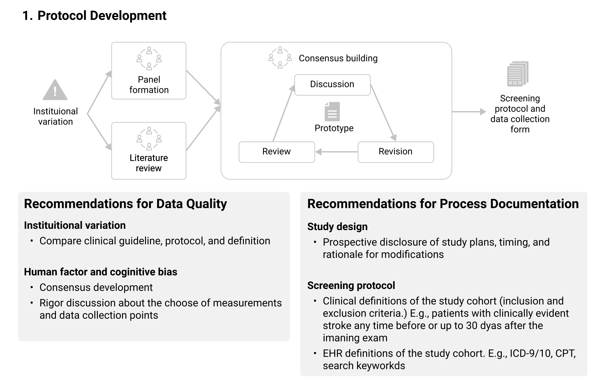
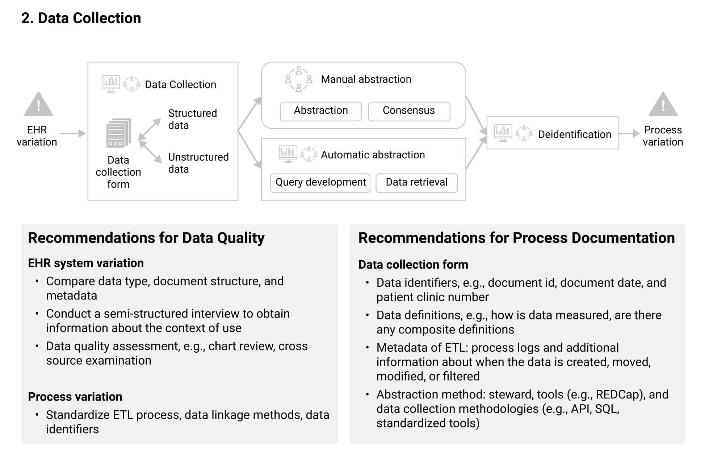
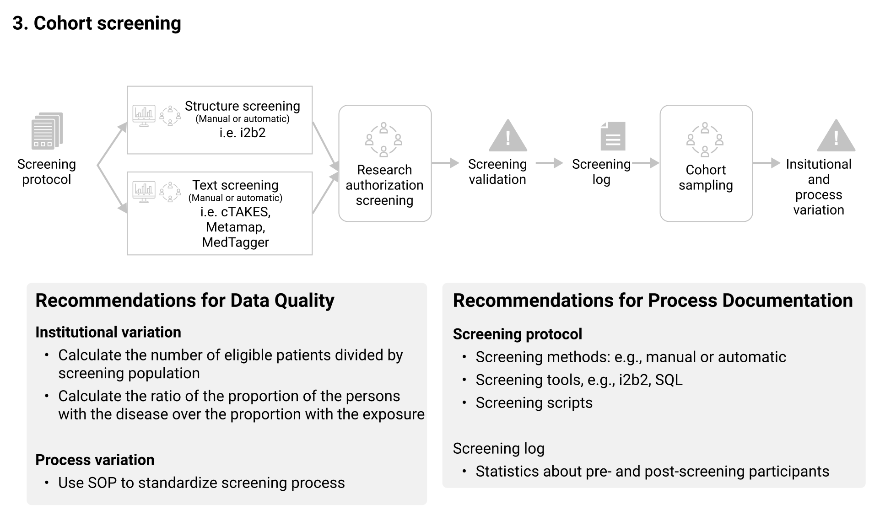
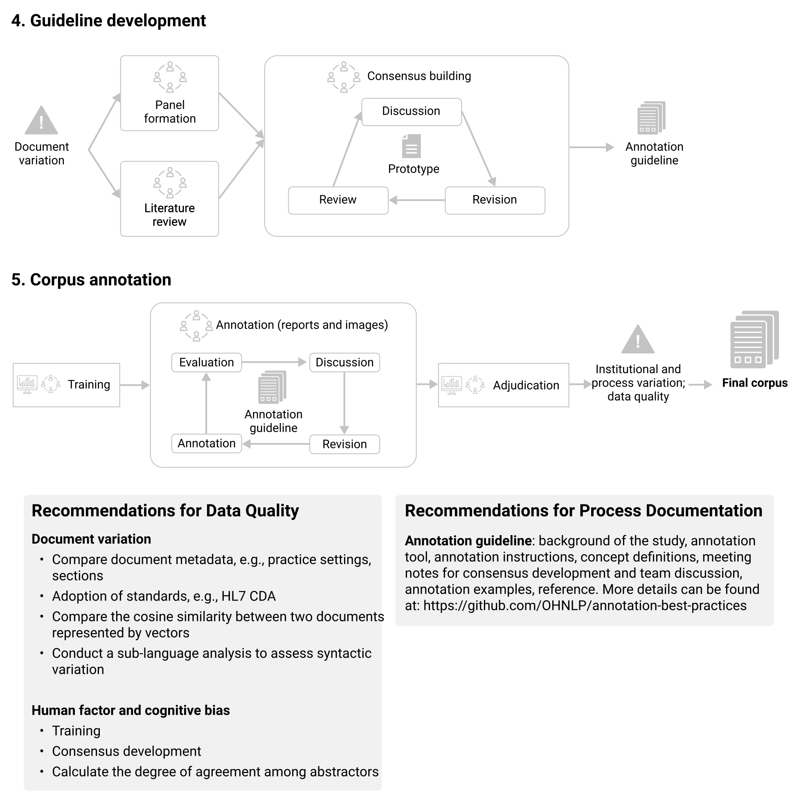

# Chapter 9: Best practices of annotating clinical texts for information extraction tasks
  
  
  

## Intended Audience

  
  
Individuals who are leading or plan to lead the curation of gold standard annotation corpora for clinical information 
extraction tasks.
  
  

## Current Version

  
Version: 0.2
  
Date: 1/26/2022
  

## Status and Feedback Mechanisms

  
This is a work-in-progress chapter. We welcome your contribution and feedback via [Github Issue](https://github.com/OHNLP/N3C-NLP-Documentation/issues).   
  
  

## Why is this important?

  
  
Unlike many of the structured data for informatics research, automatically removing protected health information from 
unstructured narratives according to the HIPAA safe harbor guideline is very challenging. Therefore, collecting clinical
 texts with human annotation from multiple institutions for collaborative research can become tricky, as the common 
quality assurance measures can only be taken after the clinical texts can be deidentified and manually reviewed. Since 
the manual annotation of information extraction tasks is typically very labor-intensive and has to be done by subject 
matter experts who may have limited bandwidth, any data quality issue that requires an update and re-review of the 
annotated data should better be addressed in the planning phase.
  
  

## Roles

  
Similar to other manual data annotation tasks,  an annotation task for information extraction may include several of the
 key contributors:
  
- **Principal Investigator (PI)**: solely responsible for the completion of the design, execution and dissemination with
 assistance from the rest of the team; 
- **Project Manager (PM)**: overseeing the execution of the study and is in charge of the communications and content 
sharing within the team as well as the external stakeholders; monitoring the project progress to make sure the 
milestones and deliverables are at goal
- **Technical Lead (TL)**: preparing the original data and annotation schema; setting up the annotation system for the 
annotators to work on; making updates based on the feedback from the rest of the team
- **Information Technology Support (IT)**: working with the TL on the extract, transform and load (ETL) process to 
prepare the data, providing the platform (hardware, software or Platform-as-a-Service solutions)
- **Annotators (ANN)**: domain experts who receive directions from the PI and PM and conduct the generation of the 
annotations, either manually or with minor systematic assistance
- **Adjudicator**: the senior annotator(s) who can make the final decisions on the annotation discrepancies between the 
ANNs in double-annotation practices. Ideally, the adjudicator should not be an annotator to avoid conflict of interest.
 
- **Data Analyst (DA)**: run necessary benchmarks (e.g. inter-annotator agreement, numbers of annotations curated) to 
ensure quality
  
  
Please note that the list below provides only a general division of the roles and functions needed. Practically, it is 
very common to have one individual taking more than one role (e.g. the PI or TL also acting as the PM, the TL also 
acting partially as IT), which is acceptable as long as there is no conflict of interest (e.g. Annotators vs. 
Adjudicator regarding judgments for subjective annotations, Annotators vs. PM regarding progress monitoring).
  
  

## Project Lifecycle

  
A common information annotation project life cycle includes the following steps
  
  
  

|ID |Steps |Action items |Stakeholders |
| :---: | :---: | :---: | :---: |
|1 |Study formulation |Cohort definition  Text corpora definition  Concepts to be extracted Institutional Review Boards (IRB) approval  Annotation guideline drafting Dissemination planning   |PI, PM, TL |
|2 |Operation planning |Timeline Milestone Team assembling Risk assessment |PI, PM, TL |
|3 |Technical planning and execution |ETL process design ETL feasibility test Annotation system identified Schema design and drafting Annotation system setup and testing |PM, TL, IT |
|4 |Sample annotation |Retrieve the corpora from Step 1, sampling texts to be annotated according to the draft annotation guideline using the annotation system setup   |PM, TL, ANN, Adjudicators, DA |
|5 |Address issues |Address issues raised up by  Updating guideline Updating timeline Updating schema Adjusting system configurations |PI, PM, TL |
|7 |Task finalized |Iterating Step 3 to Step 5 until no more issues are raised up in Step 4 on the sample data To confirm the finalization of  Annotation guideline Timeline Schema System configurations |PI, PM, TL, ANN, Adjudicators |
|7 |Annotation execution |Complete all the corpora retrieved PM and DA monitor the quality of the annotation   |PM, DA, ANN, Adjudicators |
|8 |Annotation completion |Conclude project Report metrics  |PI, PM, TL, DA |
  
  
  

## Takeaways

## Examples
- Annotation guideline - Chronic Pain: [[download](https://jmir.org/api/download?alt_name=medinform_v8i11e18659_app1.pdf&filename=c4ede3025c08f13d71cf142ece36d9b8.pdf)]

- Annotation Guideline - Delirium: [[download](https://oup.silverchair-cdn.com/oup/backfile/Content_public/Journal/biomedgerontology/PAP/10.1093_gerona_glaa275/2/glaa275_suppl_supplementary_materials_1.docx?Expires=1633381711&Signature=w3Na2GoHq1kfoxl-wCdwBI69l8UI5vH04cank9r0SZS-UFPcuM9b570z0y0h~wXdJWifVZk1t8KBSpJ2G5K~VucBUqczjwgBlt23QZh3jTZVj5LegTl1h9EmDjEJDssF-WZ0hxni63fbX0U5-iDdIa7OTAd9TAOQKnMlDjdbxdALk73dqcbDj11ZPwFo16b1AEA~dOCmq4EeE3xcROZMjs6kgUWiHOr37HI38UdLVmmWh5z8d4yEM3VyIU3EvKHUisXjlddbT--cjGSss1rFTTrk6Zf4sX-2nglQQTcALVHVIZSybc46Q1QCx387wddVRP3KuI4JqqxVJIaGrdYdNQ__&Key-Pair-Id=APKAIE5G5CRDK6RD3PGA)]

- Annotation guideline and algorithm - Fall occurrence: [[code](https://github.com/OHNLP/CRI_Chapter22)]

## Open-sourced text annotation tools
  - Brat:  brat rapid annotation tool [[link](https://brat.nlplab.org/)]
  - Anafora:  https://github.com/weitechen/anafora  
  - MAE:  Multi-document Annotation Environment [[link](http://keighrim.github.io/mae-annotation/)]
  - MedTator:  A Serverless Text Annotation Tool for Corpus Development [[link](https://github.com/OHNLP/MedTator)]
  - PubTator Central: PubTator Central (PTC) is a Web-based system providing automatic annotations of biomedical concepts such as genes and mutations in PubMed abstracts and PMC full-text articles.  [[link]( https://www.ncbi.nlm.nih.gov/research/pubtator/)]

## Annotation toolkits
The following files should be opened by Microsoft Word.
- [Standard Operating Procedure - Annotation - docx](../_static/doc/1Procedure_StandardAnnotation_R1.doc)
- [Instructions of Annotation Guideline Creation - docx](../_static/doc/2Instructions_AnnotationGuideCreation_R1.doc)
- [Annotation Guideline Template - docx](../_static/doc/3Template_AnnotationGuide_R1.docx.docx)
- [Checklist - docx](../_static/doc/4Checklist.docx)

## TRUST: clinical Text Retrieval and Use towards Scientific rigor and Transparent process.

### Protocol Development

### Data Collection

### Cohort Screening

### Corpus Annotation

### Tips and Caveats

  
- All the digital contents (e.g. guideline drafts, schema, ETL scripts, IAA calculation scripts) should be version-
controlled. 
  
  

### Communities

  
  
- BioNLP- ClinicalNLP:  2019,  2020  - Resources- Health NLP- BioCreative/OHNLP 2018- iEC Text Analytics Working Group:  https://clic-ctsa.org/groups/text-analytics-toward-semantic-interoperability-and-
data-sharing- N3C NLP Subgroup:  Home · OHNLP/N3C-NLP-Documentation Wiki (github.com)  
  
  

## Acknowledgment

  

### Contributors to this playbook chapter

  
Name|Site|ORCID
  
Sijia Liu|Mayo Clinic|0000-0001-9763-1164
  
Sunyang Fu|Mayo Clinic|0000-0003-1691-5179
  
Hongfang Liu|Mayo Clinic|0000-0003-2570-3741
  
  
  

### About the authors and contributors

  

This National Center for Data to Health (CD2H) playbook chapter is created on behalf of the Open Health Natural Language
 Processing Collaborative ([https://github.com/OHNLP](https://github.com/OHNLP)). Part of the work is also done through National COVID Cohort Collaborative (N3C) ([https://ncats.nih.gov/n3c](https://ncats.nih.gov/n3c)) Natural Language Processing (NLP) Subgroup under the Collaborative Analytics Workstream ([https://covid.cd2h.org/N3C_analytics](https://covid.cd2h.org/N3C_analytics)). More information can be found at [https://github.com/OHNLP/N3C-NLP-Documentation/wiki](https://github.com/OHNLP/N3C-NLP-Documentation/wiki).
  

### Funding

Research reported in this playbook chapter was supported by the National Center for Advancing Translational Sciences (NCATS) of the National Institutes of Health under award number U01TR002062. The content is solely the responsibility of the authors and does not necessarily represent the official views of the 
National Institutes of Health.
  
  

### Resources
  
More about clinical information extraction research:  [awesome-clinical-nlp - OHNLP](https://github.com/OHNLP/awesome-clinical-nlp)

## References

- Sunyang Fu, TRUST: Clinical Text Retrieval and Use towards Scientific Rigor and Transparent Process, 2021/12, University of Minnesota 
- Wang Y, Wang L, Rastegar-Mojarad M, Moon S, Shen F, Afzal N, Liu S, Zeng Y, Mehrabi S, Sohn S, Liu H. Clinical information extraction applications: A literature review. J Biomed Inform. 2018 Jan;77:34-49. doi: 10.1016/j.jbi.2017.11.011. Epub 2017 Nov 21. PMID: 29162496; PMCID: PMC5771858. 
- Fu, S., Chen, D., He, H., Liu, S., Moon, S., Peterson, K.J., Shen, F., Wang, L., Wang, Y., Wen, A. and Zhao, Y., Clinical Concept Extraction: a Methodology Review. Journal of biomedical informatics, p.103526. 
- Liu S, Wen A, Wang L, et al. An Open Natural Language Processing Development Framework for EHR-based Clinical Research: A case demonstration using the National COVID Cohort Collaborative (N3C). arXiv; 2021. 
- Shen F, Liu S, Fu S, Wang Y, Henry S, Uzuner O, Liu H. Family History Extraction From Synthetic Clinical Narratives Using Natural Language Processing: Overview and Evaluation of a Challenge Data Set and Solutions for the 2019 National NLP Clinical Challenges (n2c2)/Open Health Natural Language Processing (OHNLP) Competition. JMIR Med Inform. 2021 Jan 27;9(1):e24008. doi: 10.2196/24008. PMID: 33502329; PMCID: PMC7875692. 
- Mowery, D.L., Velupillai, S., South, B.R., Christensen, L.M., Martínez, D., Kelly, L., Goeuriot, L., Elhadad, N., Pradhan, S., Savova, G.K., & Chapman, W.W. (2013). Task 1: ShARe/CLEF eHealth Evaluation Lab 2013. CLEF.    
- Wei CH, Allot A, Leaman R, Lu Z. PubTator central: automated concept annotation for biomedical full text articles. Nucleic Acids Res. 2019 Jul 2;47(W1):W587-W593. doi: [10.1093/nar/gkz389](https://doi.org/10.1093/nar/gkz389). PMID: 31114887; PMCID: PMC6602571. 
- Wei-Te Chen, Will Styler. 2013. Anafora: A Web-based General Purpose Annotation Tool, In Proceedings of the NAACL-HLT, Companion Volume: Demonstrations, Atlanta, GA, USA, pp. 433-438.
- Kyeongmin Rim. MAE2: Portable Annotation Tool for General Natural Language Use. In Proceedings of the 12th Joint ACL-ISO Workshop on Interoperable Semantic Annotation, Portorož, Slovenia, May 28, 2016.
- He H, Fu S, Wang L, Liu S, Wen A, Liu H. MedTator: a serverless annotation tool for corpus development. Bioinformatics. 2022 Jan 4:btab880. doi: 10.1093/bioinformatics/btab880. PMID: 34983060.
- Carlson LA, Jeffery MM, Fu S, He H, McCoy RG, Wang Y, Hooten WM, St Sauver J, Liu H, Fan J. Characterizing Chronic Pain Episodes in Clinical Text at Two Health Care Systems: Comprehensive Annotation and Corpus Analysis. JMIR medical informatics. 2020;8(11):e18659.
- Fu S, Leung LY, Raulli AO, Kallmes DF, Kinsman KA, Nelson KB, Clark MS, Luetmer PH, Kingsbury PR, Kent DM, Liu H. Assessment of the impact of EHR heterogeneity for clinical research through a case study of silent brain infarction. BMC medical informatics and decision making. 2020 Dec;20(1):1-2.

  
