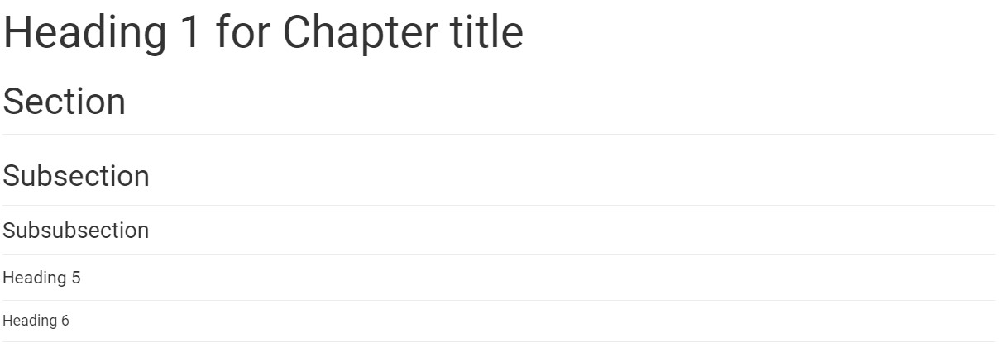

# Tutorial: How to write a chapter using markdown

This document demonstrates which formats and text styling we provide as well as best practices, how-to’s, dos and don'ts and more.


## Headings

All 6 headings are available, but you should only use `Heading 1` for the chapter title, and use `Heading 2`, `Heading 3`, ... for section, subsections, ... .

* Example:

  ```
  # Heading 1 for Chapter title

  ## Heading 2 for Section

  ### Heading 3 for Subsection

  #### Heading 4 for Subsubsection

  ##### Heading 5

  ###### Heading 6
  ```
  It should render like this:

  


## Emphasis

You can use bolds, italics and a mix of them. To add them select your text then click one of these buttons (Bolds, italics)

* Example:

  ```
  **Bold**

  *Italic*

  ~~Strikethroughs~~

  ***Mixes (bold and italic)***
  ```

  It should render like this:

  **Bold**

  *Italic*

  ~~Strikethroughs~~

  ***Mixes (bold and italic)***


## Lists

Nest lists as much you like. NOTE: numbered lists are not supported yet but will be converted to bulleted lists. To add a deeper list add a tab at the start of the line.

* **Unordered example**:

  ```
  * Item 1
  * Item 2
    * Item 2a
    * Item 2b
  ```
  It should render like this:

  * Item 1
  * Item 2
    * Item 2a
    * Item 2b

* **Ordered example**:
  ```
  1. Item 1
  1. Item 2
  1. Item 3
     1. Item 3a
     1. Item 3b
   ```
  It should render like this:

  1. Item 1
  1. Item 2
  1. Item 3
     1. Item 3a
     1. Item 3b


## Links
The embeded links will be automatically converted to clickable links. You can also use the markdown syntax `[link text](link url)` to create a link to any URL, including the link to any section or subsection.

* Example:

  ```
  https://cd2h.org/
  [CD2H website](https://cd2h.org/)
  Links to [the "Code block" section](#code-block)
  ```
  It should render like this:

  https://cd2h.org/

  [CD2H website](https://cd2h.org/)

  Links to [the "Code block" section](#code-block)

## Tables

Tables are also supported. 1st row will be bolded, use this to explain what your data is in each column.

* Example
  ```
  First Header | Second Header
  ------------ | -------------
  Content from cell 1 | Content from cell 2
  Content in the first column | Content in the second column
  Content in the first column | Content in the second column
  ```
  It should render like this:

  First Header | Second Header
  ------------ | -------------
  Content from cell 1 | Content from cell 2
  Content in the first column | Content in the second column
  Content in the first column | Content in the second column

## Figures
You can add figures as you like but each figure will take a row of each own.

* Example
  ```
  

  
  ```
  It should render like this:

  

  


## Videos
To include a video, you can upload it to Youtube first and then add its YouTube URL like this:

* Example
  ~~~
  ```eval_rst
  .. youtube:: https://www.youtube.com/watch?v=0JPjw1_iRKY
  ```
  ~~~
  or just the Youtube id:
  ~~~
  ```eval_rst
  .. youtube:: 0JPjw1_iRKY
  ```
  ~~~
  It should render like this
  ```eval_rst
  .. youtube:: https://www.youtube.com/watch?v=0JPjw1_iRKY
  ```

## Code block

You can embed a block of code in the text, with the optional syntax-highlighting as well. ``` ``two backticks`` ```

* Example
  ````
  ```
  function fancyAlert(arg) {
    if(arg) {
      $.facebox({div:'#foo'})
    }
  }
  ```
  ````
  It should render like this:
  ```
  function fancyAlert(arg) {
    if(arg) {
      $.facebox({div:'#foo'})
    }
  }
  ```

  Optionally, you can enable the syntax-highlighting:

  ````
  ```javascript
  function fancyAlert(arg) {
    if(arg) {
      $.facebox({div:'#foo'})
    }
  }
  ```
  ````
  It should render like this:
  ```javascript
  function fancyAlert(arg) {
    if(arg) {
      $.facebox({div:'#foo'})
    }
  }
  ```
  You can replace `javascript` with other language types like `python`, `bash`, etc.

## Inline code
You can also embed an inline code in a paragraph.

* Example
  ```
  You can call this Python function `do_analysis` to get the result.
  ```
  It should render like this:

  You can call this Python function `do_analysis` to get the result.


## Math formula
You can include math formula using double dollar signs.

* Example
  ```
  $$\omega = d\phi / dt$$

  $$I = \int \rho R^{2} dV$$
  ```
  It should render like this:

  $$\omega = d\phi / dt$$

  $$I = \int \rho R^{2} dV$$

  ```eval_rst
  .. math::
  ```

## Special text box
You can add some special text box to emphasize some content.

* Example
  ~~~
  ```eval_rst
  .. note::

    This is a special note.
  ```

  ```eval_rst
  .. warning::

    This is a warning message.
  ```

  ```eval_rst
  .. hint::

    Here you can provide a hint message.
  ```
  ~~~
  It should render like this:

  ```eval_rst
  .. note::

    This is a special note.
  ```

  ```eval_rst
  .. warning::

    This is a warning message.
  ```

  ```eval_rst
  .. hint::

    Here you can provide a hint message.
  ```


## Footnotes

 [1](#kix.yqiegj2x8ffu)Footnotes are also available. All footnotes will be gathered and added at the bottom of the document under a “References” header. Footnote numbers will be automatically converted to links that point to the corresponding footnote.
To manually add a citation to a footnote in markdown first create a "References" header at the bottom of the chapter. Add there all the footnotes you want. Then add your citation in the text. To link a citation and a footnote together add the same link to the start of each line (both the citation and the footnote).
The footnote link can be empty to not display anything. To see how it's done look at the citation at the start of this paragraph and the footnote at the end of the chapter below the "References" header.


[](h.gyomvl99x239)
### Things to look for:

- Try not to mix “Emphasis” or “Link” elements with other elements such as headers and titles because it might add additional unwanted new lines.
- Try not to add too much formatting in your “Heading” elements like bolds, italics etc. Also try not to extend these to multiple lines.
- Images will span full width of the document.
- Direct videos are not available, but you can paste a youtube link and it will be embedded in the final result automatically.
- Don’t use “Heading” elements for anything other than headers. Each heading will be added to the table of contents so long text should be avoided.
- Tables inside cells are not supported

[](h.2g9x401awxf6)
## Pro-tips:


- All headings will automatically be added to the table of contents.

## References
[](#kix.yqiegj2x8ffu) Footnote 1


