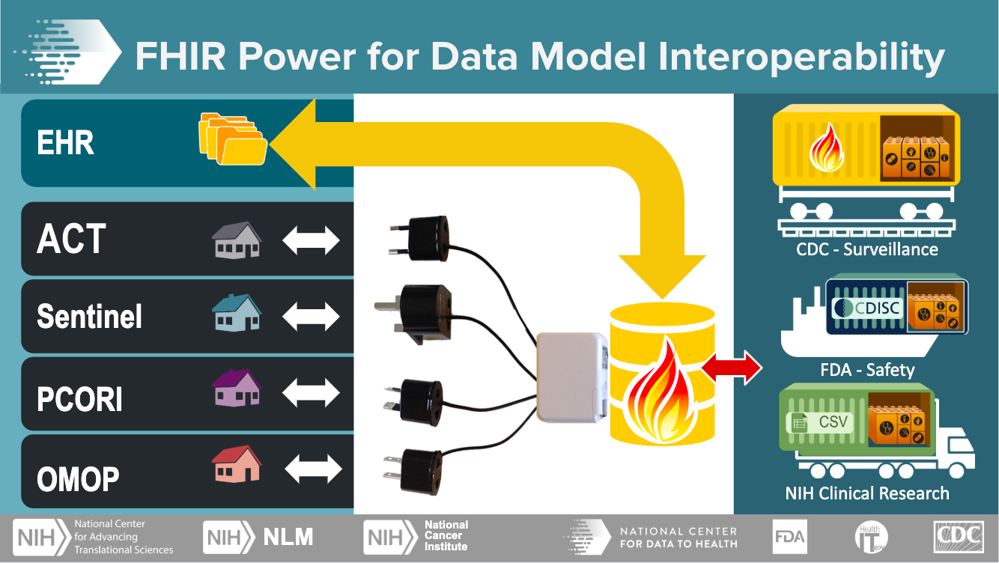
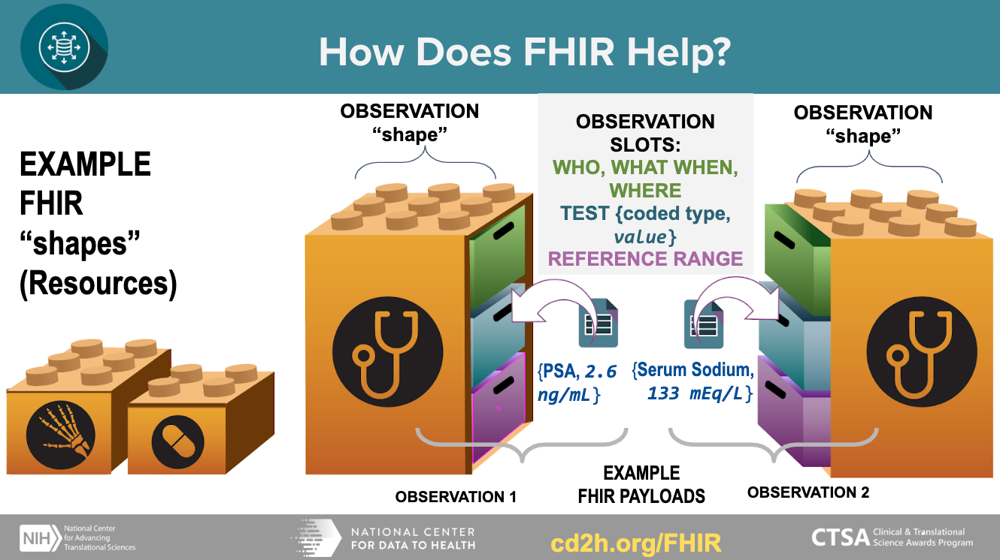

# Tutorial: How to write a chapter using markdown

This document demonstrates which formats and text styling we provide as well as best practices, how-to’s, dos and don'ts and more.


## Headings

All 6 headings are available, but you should only use `Heading 1` for the chapter title, and use `Heading 2`, `Heading 3`, ... for section, subsections, ... .

* Example:

  ```
  # Heading 1 for Chapter title

  ## Heading 2 for Section

  ### Heading 3 for Subsection

  #### Heading 4 for Subsubsection

  ##### Heading 5

  ###### Heading 6
  ```
  It should render like this:

  


## Emphasis

You can use bolds, italics and a mix of them. To add them select your text then click one of these buttons (Bolds, italics)

* Example:

  ```
  **Bold**

  *Italic*

  ~~Strikethroughs~~

  ***Mixes (bold and italic)***
  ```

  It should render like this:

  **Bold**

  *Italic*

  ~~Strikethroughs~~

  ***Mixes (bold and italic)***


## Lists

Nest lists as much you like. NOTE: numbered lists are not supported yet but will be converted to bulleted lists. To add a deeper list add a tab at the start of the line.

* **Unordered example**:

  ```
  * Item 1
  * Item 2
    * Item 2a
    * Item 2b
  ```
  It should render like this:

  * Item 1
  * Item 2
    * Item 2a
    * Item 2b

* **Ordered example**:
  ```
  1. Item 1
  1. Item 2
  1. Item 3
     1. Item 3a
     1. Item 3b
   ```
  It should render like this:

  1. Item 1
  1. Item 2
  1. Item 3
     1. Item 3a
     1. Item 3b


## Links
The embeded links will be automatically converted to clickable links. You can also use the markdown syntax `[link text](link url)` to create a link to any URL, including the link to any section or subsection.

* Example:

  ```
  https://cd2h.org/
  [CD2H website](https://cd2h.org/)
  Links to [the "Code block" section](#code-block)
  ```
  It should render like this:

  https://cd2h.org/

  [CD2H website](https://cd2h.org/)

  Links to [the "Code block" section](#code-block)

## Tables

Tables are also supported. 1st row will be bolded, use this to explain what your data is in each column.

* Example
  ```
  First Header | Second Header
  ------------ | -------------
  Content from cell 1 | Content from cell 2
  Content in the first column | Content in the second column
  Content in the first column | Content in the second column
  ```
  It should render like this:

  First Header | Second Header
  ------------ | -------------
  Content from cell 1 | Content from cell 2
  Content in the first column | Content in the second column
  Content in the first column | Content in the second column

## Figures
You can add figures as you like but each figure will take a row of each own.

* Example
  ```
  

  
  ```
  It should render like this:

  

  


## Videos
To include a video, you can upload it to Youtube first and then add its YouTube URL like this:

* Example
  ~~~
  ```eval_rst
  .. youtube:: https://www.youtube.com/watch?v=0JPjw1_iRKY
  ```
  ~~~
  or just the Youtube id:
  ~~~
  ```eval_rst
  .. youtube:: 0JPjw1_iRKY
  ```
  ~~~
  It should render like this
  ```eval_rst
  .. youtube:: https://www.youtube.com/watch?v=0JPjw1_iRKY
  ```

## Code block

You can embed a block of code in the text, with the optional syntax-highlighting as well. ``` ``two backticks`` ```

* Example
  ````
  ```
  function fancyAlert(arg) {
    if(arg) {
      $.facebox({div:'#foo'})
    }
  }
  ```
  ````
  It should render like this:
  ```
  function fancyAlert(arg) {
    if(arg) {
      $.facebox({div:'#foo'})
    }
  }
  ```

  Optionally, you can enable the syntax-highlighting:

  ````
  ```javascript
  function fancyAlert(arg) {
    if(arg) {
      $.facebox({div:'#foo'})
    }
  }
  ```
  ````
  It should render like this:
  ```javascript
  function fancyAlert(arg) {
    if(arg) {
      $.facebox({div:'#foo'})
    }
  }
  ```
  You can replace `javascript` with other language types like `python`, `bash`, etc.


## Inline code
You can also embed an inline code in a paragraph.

* Example
  ```
  You can call this Python function `do_analysis` to get the result.
  ```
  It should render like this:

  You can call this Python function `do_analysis` to get the result.


## Math formula
You can include math formula using double dollar signs.

* Example
  ```
  $$\omega = d\phi / dt$$

  $$I = \int \rho R^{2} dV$$
  ```
  It should render like this:

  $$\omega = d\phi / dt$$

  $$I = \int \rho R^{2} dV$$

  ```eval_rst
  .. math::
  ```

## Special text box
You can add some special text box to emphasize some content.

* Example
  ~~~
  ```eval_rst
  .. note::

    This is a special note.
  ```

  ```eval_rst
  .. warning::

    This is a warning message.
  ```

  ```eval_rst
  .. hint::

    Here you can provide a hint message.
  ```
  ~~~
  It should render like this:

  ```eval_rst
  .. note::

    This is a special note.
  ```

  ```eval_rst
  .. warning::

    This is a warning message.
  ```

  ```eval_rst
  .. hint::

    Here you can provide a hint message.
  ```


## Citations

To add a citation in the text, you can add a link where the citation is referenced:
 
 ```
 Data modeling is the process of determining which data elements will be stored and how they will be stored, including their relationships and constraints. The structure and definitions of a data model define what data can be stored, how values should be interpreted, and how easily data can be queried [1](#kix.unntzb98ia8x).
 ```

And then add the actual citation text in the "**References**" section, usually the last section of the chapter:

 ```
 ## References
 
 [](#kix.unntzb98ia8x) Kahn, M. G., Batson, D., & Schilling, L. M. (2012). Data model considerations for clinical effectiveness researchers. *Medical care*, *50 Suppl*(0), S60–S67. [https://doi.org/10.1097/MLR.0b013e318259bff4](https://doi.org/10.1097/MLR.0b013e318259bff4)
 ```
 
 The inline citation link are associted to the corresponding reference item based on the same link, e.g. `#kix.unntzb98ia8x` in this example. This example should renders like this:
 
 >Data modeling is the process of determining which data elements will be stored and how they will be stored, including their relationships and constraints. The structure and definitions of a data model define what data can be stored, how values should be interpreted, and how easily data can be queried [1](#kix.unntzb98ia8x).
 
 And you can cite the same reference multiple times in the text, as long as you use the same link. For example, this is the first citation [2](#kix.9r1ayja43czo) and we can cite it again here [2](#kix.9r1ayja43czo).


## A few extra notes

- Try not to mix “Emphasis” or “Link” elements with other elements such as headers and titles because it might add additional unwanted new lines.
- Try not to add too much formatting in your “Heading” elements like bolds, italics etc. Also try not to extend these to multiple lines.
- Images will span full width of the document.
- Direct videos are not available, but you can paste a youtube link and it will be embedded in the final result automatically.
- Don’t use “Heading” elements for anything other than headers. Each heading will be added to the table of contents so long text should be avoided.
- Tables inside cells are not supported.
- All headings will automatically be added to the table of contents.


## References

[](#kix.unntzb98ia8x) Kahn, M. G., Batson, D., & Schilling, L. M. (2012). Data model considerations for clinical effectiveness researchers. *Medical care*, *50 Suppl*(0), S60–S67. [https://doi.org/10.1097/MLR.0b013e318259bff4](https://doi.org/10.1097/MLR.0b013e318259bff4)

[](#kix.9r1ayja43czo) Knosp B, Craven CK, Dorr D, Campion T. Understanding enterprise data warehouses to support clinical and translational research. J Am Med Infom Assoc. Accepted for publication 2020 April 27. [Cited 2020 April 30]


